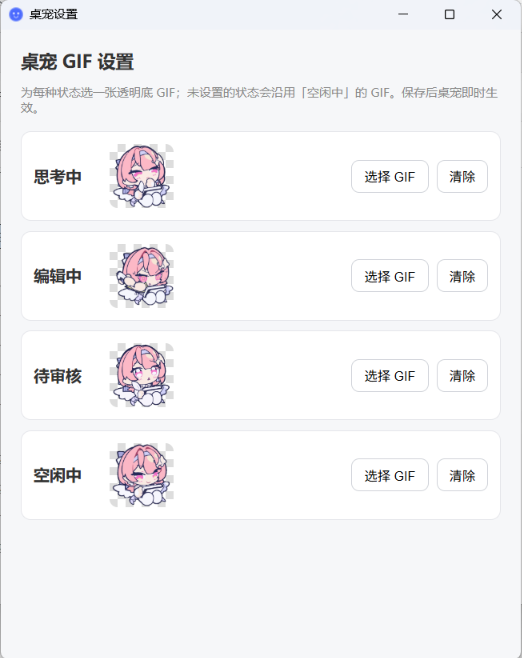

# kimi-pet

Kimi Code 桌宠：一个常驻桌面的透明小窗，跟着本机 `kimi web` 服务的实时状态切换 GIF。

## 下载（Windows x64）

到 [Releases](https://github.com/LJF-0125/Kimi-pet-engine/releases) 下载：

- **`kimi-pet_*_x64-setup.exe`（推荐）**：NSIS 安装包，安装版支持应用内自动更新——检测到新版本会弹窗提示，点「立即更新」自动下载安装并重启。
- **`kimi-pet.exe`**：绿色单文件，双击即用，内置默认形象，无需任何配置；不支持自动更新，需手动下载新版覆盖。

> 未签名软件的正常提示：Edge 下载时若提示"通常不会下载"，点 `...` → **保留** → **仍然保留**；
> 运行时若弹"Windows 已保护你的电脑"，点 **更多信息** → **仍要运行**。

## 四种状态

| 状态 | 触发时机 |
| --- | --- |
| 思考中 | 模型推理 / 调用工具干活 |
| 编辑中 | 正在流式输出回复正文 |
| 待审核 | 弹出权限审批或提问，等你处理 |
| 空闲中 | 一轮结束 / 服务刚连上；服务离线超过 10 秒时 GIF 会变灰 |

## 交互

- **拖动**：按住桌宠拖到任意位置
- **双击**：用系统浏览器打开 Kimi Code Web 界面
- **右键桌宠**：打开设置窗口（可调桌宠大小，50%–250%）
- **托盘图标**：左键单击打开设置；右键菜单可退出程序
- **跟随启动**：设置窗口勾选「跟随 Kimi Code 启动」后，每次 Kimi Code 开会话都会自动拉起桌宠（原理是往 `~/.kimi-code/config.toml` 写入官方 SessionStart hook；取消勾选即移除）。注意：hook 只在 Kimi Code 进程启动时加载，勾选/取消时若 `kimi web` 已在运行，需重启它后变更才生效（设置窗口会提示）；TUI 里会话是发出首条消息时才创建的，桌宠在那一刻拉起；已有桌宠在跑时重复触发会被单实例保护忽略
- **跟随退出**：设置窗口勾选「Kimi Code 退出后自动关闭」后，`kimi web` 服务主动关停时桌宠立即退出；服务失联（如进程被杀）持续约 2 分钟也会退出。本次运行从未连上过服务（比如单独打开桌宠）则不会自动退出

## 自定义形象

设置窗口里为四种状态各选一张 GIF（**透明底**最佳），即时生效、自动保存：



不上传也没关系——应用内置了一套默认 GIF；清除自定义图后会回落到默认形象。

GIF 来源：绝区零游戏蕾米埃尔 Q 版形象。

## 原理

`kimi web` 启动的本地服务暴露 REST + WebSocket API（默认 `127.0.0.1:58627`）。
本应用自动读取 `~/.kimi-code/server.token`、探测端口、连接 `/api/v1/ws` 事件流，
以 agent 自报的 `agent.status.updated` 阶段事件为主、REST 轮询 `busy` / `pending_interaction`
校准为辅，聚合成四种状态推送给窗口。服务断开自动重连，断线 10 秒内保持原状态不灰化。

注意：该 API 是实验性的，字段可能随 Kimi Code 版本变化。

## 运行（需要 Rust 环境）

```sh
# 1. 安装 Rust（Mac / Linux）
curl --proto '=https' --tlsv1.2 -sSf https://sh.rustup.rs | sh
# Windows 下载 rustup-init.exe：https://rustup.rs

# 2. 编译运行（需先在本机跑着 kimi web）
cd src-tauri
cargo run --release
```

## 打包

```sh
cd src-tauri
cargo build --release   # 单文件 exe 在 target/release/kimi-pet.exe
```

也可以用 `cargo tauri build` 出安装包（产物在 `src-tauri/target/release/bundle/`），
或推到 GitHub 后用 `tauri-apps/tauri-action` 同时出 macOS 和 Windows 安装包。

自动更新：在仓库 Secrets 配置 `TAURI_SIGNING_PRIVATE_KEY`（及密码，若设置了的话）后，
tauri-action 会自动给更新包签名并生成 `latest.json` 挂到 release；
客户端按 `tauri.conf.json` 里的 `plugins.updater.pubkey` 验签，公钥与私钥要配对。
密钥的生成与配置步骤见 [docs/updater-signing.md](docs/updater-signing.md)。

## 使用前提

桌宠和 `kimi web` 必须在**同一台电脑**上运行（它连的是 127.0.0.1 的本地服务）。
先用 `kimi web` 启动 Kimi Code 的 web 模式，再启动桌宠。
